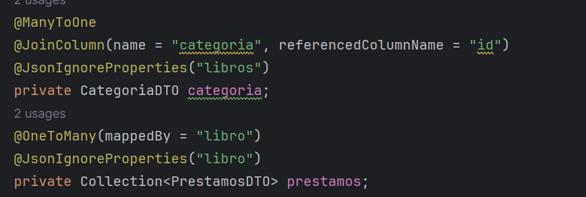

<h1 align="center">Proyecto Biblioteca SpringBoot</h1>

  

&nbsp;&nbsp;
&nbsp;&nbsp;

## 📄 Descripción

El proyecto consiste en dos aplicaciones: por un lado un microservicio API REST desarrollado en java con **Springboot** y por otro
una aplicación **cliente** desarrollada en Java Swing.

<b>Tecnologías:</b> 
  
  
  
  

# Aplicación Spring Boot (API REST) ⚙️

La API REST proporciona endpoints para realizar operaciones CRUD (Crear, Leer, Actualizar y Eliminar) en las siguientes entidades:

## Controladores 📚
Los controladores gestionan las operaciones relacionadas con su respectiva entidad, como crear un nuevo usuario, obtener información sobre libros, etc. Los controladores incluyen:
- Usuario
- Categoría
- Bibliotecario
- Libro
- Préstamos

## Endpoints 📍
Para comprender cómo hemos utilizado los diversos puntos finales para el enrutamiento de las distintas operaciones de una entidad, tomaremos como ejemplo las anotaciones en la clase ControllerCategoria:

### Anotaciones de Spring 🌱
- `@RestController`: Indica a Spring que esta clase funcionará como un controlador. Los métodos de esta clase devolverán objetos que se serializarán directamente en el cuerpo de la respuesta HTTP.
- `@RequestMapping("/biblioteca/categorias")`: Asigna la clase ControllerCategoria a una ruta URI que finaliza con "/biblioteca/categorias".
- `@GetMapping`: Asigna solicitudes HTTP GET a los métodos de búsqueda (SELECT) dentro del controlador. Para la entidad de categoría, tenemos:
  - `@GetMapping`: Para el método getAllCategorias(), que devuelve todas las categorías de la base de datos utilizando findAll().
  - `@GetMapping("/{id}")`: Para el método getCategoriaById(id), que devuelve la categoría de la base de datos utilizando findById(id).
- `@PostMapping`: Asigna solicitudes HTTP POST al método de guardar (INSERT) dentro del controlador, en este caso, saveCategoria(categoria).
- `@DeleteMapping("/{id}")`: Asigna solicitudes HTTP DELETE al método de borrar dentro del controlador, en este caso, deleteCategoria(id).
- `@PutMapping("/{id}")`: Asigna solicitudes HTTP PUT al método de actualizar (UPDATE) dentro del controlador, en este caso, updateCategoria(nuevaCategoria, id).
- `@Autowired`: Realiza la inyección automática de dependencias en los campos o constructores. Esto evita la necesidad de crear manualmente instancias de objetos, ya que Spring se encarga de ello.
- `@PathVariable`: Vincula variables de la URI de una solicitud HTTP a los parámetros de un método del controlador, permitiendo que los valores de las partes variables de la URL se pasen como argumentos al método.
- `@Validated`: Activa la validación de los parámetros de un método del controlador, asegurando que los objetos pasados como argumentos sean validados según las restricciones definidas en las anotaciones de validación de Bean Validation (por ejemplo, @NotNull, @Size, @Email, etc.).
- `@RequestBody`: Indica que un parámetro del controlador debe estar vinculado al cuerpo de la solicitud HTTP entrante, convirtiéndolo en el tipo de objeto correspondiente.

# Aplicación Cliente (Java Swing) ☕️

La aplicación cliente proporciona una interfaz de usuario amigable para interactuar con la API REST. Incluye:

## HTTPRequests 🌐
Módulos para realizar peticiones HTTP a la API en cada entidad:
- Request Categoría
- Request Libro
- Request Préstamos
- Request Usuario

## CRUD Cliente 🖥️
Clases para realizar operaciones CRUD en cada entidad:
- Presentador Usuario
- Presentador Libro
- Presentador Categoría
- Presentador Préstamos

Estos presentadores actúan como la capa intermedia entre la interfaz de usuario y las solicitudes HTTP, gestionando la lógica de negocio y la presentación de datos.

### Esquema Conceptual 🌍

     +---------------------+       HTTP Requests        +------------------------+
     |        Cliente      |  <---------------------->  |    API REST (Spring    |
     |    (Java Swing)     |                            |         Boot)          |
     +---------------------+                            +------------------------+
              |                                                      |
              |               Interfaz de Usuario                     |
              +------------------------------------------------------+
                                           |
                                           | Peticiones HTTP
                                           |
                                           V
                                  +----------------------------+
                                  |   Controladores de la API   |
                                  |    (Usuario, Categoría,    |
                                  |      Libro, Préstamos)     |
                                  +----------------------------+
                                           |
                                           | Acceso a la base de datos
                                           |
                                           V
                                  +----------------------------+
                                  |     Base de Datos MySQL    |
                                  +----------------------------+

  
## Dificultates Encontradas  ⚠️ 

- Bucle Infinito : Etiqueta @JsonIgnoreProperties para evitar bucle infinito al generar el Json
  

- Unknown Column in Field List: No existe la columna en la base de datos.
- Error en el método toJson() de Libro

## 🚀 Instrucciones de Uso

Para ejecutar la aplicación, sigue estos pasos:

1. Clona este repositorio en tu máquina local.
2. Importa el proyecto en tu IDE de Java preferido.
3. Configura la conexión a la base de datos MySQL en el archivo `application.properties`.
4. Ejecuta la aplicación Spring Boot para iniciar el servidor.
5. Ejecuta la aplicación cliente para interactuar con la API.

