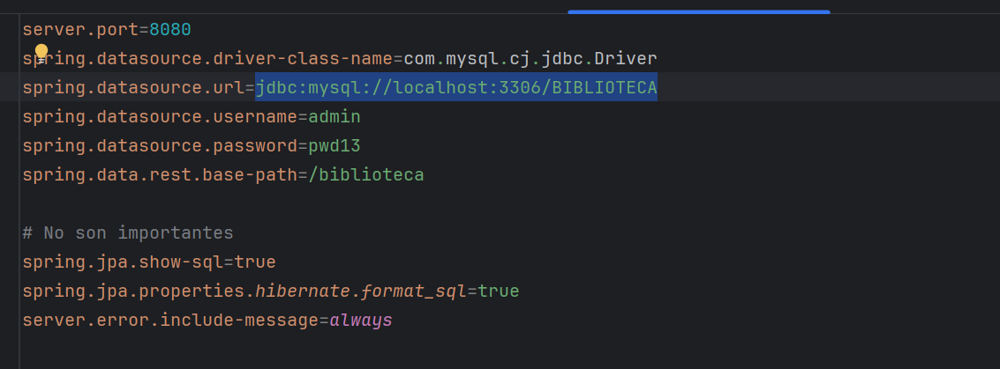
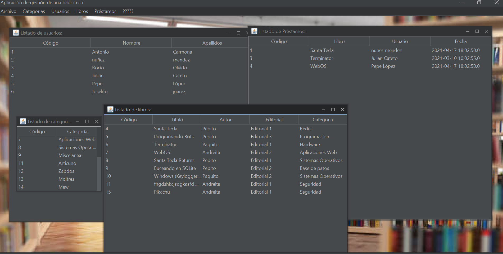

<h1 align="center">Proyecto Biblioteca SpringBoot</h1>

  

&nbsp;&nbsp;
&nbsp;&nbsp;

## 📄 Descripción

El proyecto consiste en dos aplicaciones: por un lado un microservicio API REST desarrollado en java con **Springboot** y por otro
una aplicación **cliente** desarrollada en Java Swing.

<b>Tecnologías:</b> 
  
  
  
  

# Conexión a la base de datos:

# Aplicación Spring Boot (API REST) ⚙️

La API REST proporciona endpoints para realizar operaciones CRUD (Crear, Leer, Actualizar y Eliminar) en las siguientes entidades:

## Controladores 📚
Los controladores gestionan las operaciones relacionadas con su respectiva entidad, como crear un nuevo usuario, obtener información sobre libros, etc. Los controladores incluyen:
- Usuario
- Categoría
- Bibliotecario
- Libro
- Préstamos

## Endpoints 📍
Para comprender cómo hemos utilizado los diversos puntos finales para el enrutamiento de las distintas operaciones de una entidad, tomaremos como ejemplo las anotaciones en la clase ControllerCategoria:

### Anotaciones de Spring 🌱

- `@RestController`: Marca la clase como controlador.
- `@RequestMapping("/biblioteca/categorias")`: Asigna una ruta a la clase.
- `@GetMapping`: Maneja solicitudes GET para búsqueda.
- `@PostMapping`: Maneja solicitudes POST para guardar.
- `@DeleteMapping("/{id}")`: Maneja solicitudes DELETE para borrar.
- `@PutMapping("/{id}")`: Maneja solicitudes PUT para actualizar.
- `@Autowired`: Inyección automática de dependencias.
- `@PathVariable`: Vincula variables de la URI a los parámetros.
- `@Validated`: Activa validación de parámetros.
- `@RequestBody`: Vincula parámetros al cuerpo de la solicitud HTTP.

# Aplicación Cliente (Java Swing) ☕️

La aplicación cliente proporciona una interfaz de usuario amigable para interactuar con la API REST. Incluye:

## HTTPRequests 🌐
Módulos para realizar peticiones HTTP a la API en cada entidad:
- Request Categoría
- Request Libro
- Request Préstamos
- Request Usuario

## CRUD Cliente 🖥️
Clases para realizar operaciones CRUD en cada entidad:
- Presentador Usuario
- Presentador Libro
- Presentador Categoría
- Presentador Préstamos

Estos presentadores actúan como la capa intermedia entre la interfaz de usuario y las solicitudes HTTP, gestionando la lógica de negocio y la presentación de datos.

### Esquema Conceptual 🌍

     +---------------------+       HTTP Requests        +------------------------+
     |        Cliente      |  <---------------------->  |    API REST (Spring    |
     |    (Java Swing)     |                            |         Boot)          |
     +---------------------+                            +------------------------+
              |                                                      |
              |               Interfaz de Usuario                     |
              +------------------------------------------------------+
                                           |
                                           | Peticiones HTTP
                                           |
                                           V
                                  +----------------------------+
                                  |   Controladores de la API   |
                                  |    (Usuario, Categoría,    |
                                  |      Libro, Préstamos)     |
                                  +----------------------------+
                                           |
                                           | Acceso a la base de datos
                                           |
                                           V
                                  +----------------------------+
                                  |     Base de Datos MySQL    |
                                  +----------------------------+

## ✨ Nuevas funcionalidades

- Exportar tablas a csv
- Imagen de fondo
- Seleccionar libros pertenecientes a una categoría
- Eliminar errores molestos  

## 🚀 Instrucciones de Uso

Para ejecutar la aplicación, sigue estos pasos:

1. Clona este repositorio en tu máquina local.
2. Importa el proyecto en tu IDE de Java preferido.
3. Configura la conexión a la base de datos MySQL en el archivo `application.properties`.
4. Ejecuta la aplicación Spring Boot para iniciar el servidor.
5. Ejecuta la aplicación cliente para interactuar con la API.

